#### 参考网站
* https://www.chessprogramming.org/Main_Page
* https://www.xqbase.com/computer.htm
* https://lichess.org/  

**一、程序运行环境**

-   **Python 3.10**
-   **相关库：**

    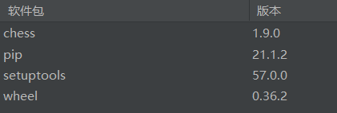

    **pip install python-chess/conda install python-chess**

    **import chess**

-   **环境配置**

    **UI界面需要lichess的支持。**

-   将 repo 下载到 lichess-bot 目录中。
-   导航到 cmd/Terminal: 中的目录cd lichess-bot。
-   安装pip：apt install python3-pip.
-   安装虚拟环境：pip install virtualenv.
-   设置虚拟环境：apt install python3-venv。

    python3 -m venv venv \# If this fails you probably need to add Python3 to your PATH.

    virtualenv venv -p python3 \# If this fails you probably need to add Python3 to your PATH.

    source ./venv/bin/activate

    python3 -m pip install -r requirements.txt

-   复制config.yml.default到config.yml.

详情参照https://github.com/ShailChoksi/lichess-bot。

\*\*  
\*\*

**二、主要技术**

**2.1棋盘表示**

国际象棋程序需要一个内部棋盘表示来维护其搜索、评估和游戏的国际象棋位置。除了用棋子放置对棋盘进行建模之外，还需要一些额外的信息来完全指定棋子的位置，例如要移动的方位、易位权、可能的过路目标方格以及跟踪五十步棋的可逆步数规则。

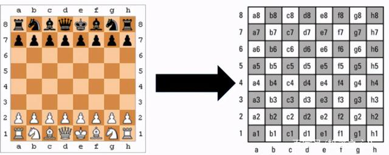

图1 棋盘的表示

首先，我们进一步详细说明了代表棋盘及其棋子放置的纯数据结构。有以块为中心和以正方形为中心的表示以及混合解决方案。

-   以片为中心

以棋子为中心的表示形式将所有棋子的列表、数组或集合保留在棋盘上 - 以及它们占据哪个方格的相关信息。一个流行的以块为中心的代表是 set-wise bitboard-approach。每个片段类型一个 64 位字，其中一位与它们的占用相关联。

-   方形中心

以正方形为中心的表示实现了反向关联 -正方形是空的还是被特定的一块占据？最流行的以正方形为中心的表示形式，邮箱或它的0x88增强功能 - 基本上是直接片段代码的数组，包括空方块和可能的板外代码。混合解决方案可能会进一步引用片段列表条目。

-   混合解决方案

虽然国际象棋程序中的不同算法和任务可能更喜欢这些关联中的一种，但将冗余棋盘表示与两者的元素一起使用是很常见的。位板方法通常保留 8x8 棋盘来逐个确定棋子，而以正方形为中心的棋盘阵列方法通常保留棋子列表和/或棋子集，以避免出于移动生成目的而扫描棋盘。

代码说明：board = chess.Board()

board 对象是一个完整的 board 表示，该对象为我们提供了一些重要的函数，例如，board.is_checkmate() 函数检查是否存在将杀（checkmate），board.push() 函数附加一个移动，board.pop() 函数撤销最后一次移动等。

**2.2 着法的产生**

自从朝前裁剪被淘汰以后，最直接的实现完全搜索的方法是：

1\. 找到局面中所有合理的着法；

2\. 对他们进行排列，想要提高搜索速度就必须选择最佳的顺序；

3\. 对他们逐一进行搜索，直到全部搜索完成或者被截断【运用Alpha-Beta等搜索方法，可以在特定的情况提前中止搜索，以后的搜索就没有必要，这种情况就称为“截断”(Cut-off)】。

早期的程序(例如Sargon)每次都扫描棋盘的每个格子，找有没有可以移动的棋子，然后计算可能的着法。当时存储器是稀有矿产，额外花费CPU的时间每次把着法重新计算一遍，是别无选择的蠢事。

如今，预处理的数据结构可以避免大量计算，而复杂的代码会多花费几十KB的空间。当这个超快的着法产生方法和置换表结合在一起的时候，程序员眼前又多了一条思路——如果某些着法已经被搜索过，它的价值(保存在置换表中)足以产生截断，那么根本就不需要搜索任何着法了。很明显，置换表越大，并且置换可能越多(它由游戏规则决定)，置换表的作用就越明显。

这个技术不仅在概念上简单，而且普遍适用于其他游戏(但着法却不是普遍适用的，象棋着法可以分为吃子和不吃子，其他游戏像黑白棋就不那么容易分类了)。

**2.3 搜索算法**

因为很难静态地找到或猜测一个棋位的好棋步，所以国际象棋程序依赖某种类型的搜索来合理下棋。搜索包括向前看不同的移动序列并在移动后评估位置。形式上，搜索具有完美信息的两人零和棋盘游戏意味着通过各种搜索算法遍历和最小化树状数据结构。

大多数国际象棋程序使用alpha-beta算法的变体以深度优先的方式搜索树，以获得比纯minimax算法提高一个数量级的性能。尽管移动排序不会影响纯 mini-max 搜索的性能（因为所有分支和节点都被搜索），但它对于 alpha beta 搜索和PVS、NegaScout和MTD(f)等增强的性能变得至关重要。Hans Berliner 的国际象棋程序HiTech和Ulf Lorenz 的程序P.ConNerS使用最佳优先相当成功地接近。

**NegaMax（Negated Minimax）**

伪代码如下：

int negaMax( int depth ) {

if ( depth == 0 ) return evaluate();

int max = -oo;

for ( all moves) {

score = -negaMax( depth - 1 );

if( score \> max )

max = score;

}

return max;

}

当走子一方改变时就要对返回值取负值，以反映当前局面评价的更改。就根结点是白先走的情况，如果没有剩下的层数，那么“评价”返回的值是就白方而言的，如果有剩下的层数，就产生后续局面，函数对这些局面逐一做递归，每个次递归都得到就黑方而言的评价，黑方走得越好值就越大。当评价值返回时，它们被取负数，变成就白方而言的评价。

该函数在遍历时结点的顺序同“最小-最大”搜索的函数是一样的，产生的返回值也一样。它的代码更短，同时减少了移植代码时出错的可能，代码维护起来也比较方便。

**Alpha-beta 修剪**

Alpha-beta pruning 是 minimax 算法的一种优化方法，它允许我们忽略搜索树中的一些分支。这有助于我们更深入地评估极小极大搜索树，同时使用相同的资源。

alpha-beta 剪枝基于这样一种情况：如果我们发现一个导致比先前发现的移动更糟糕的情况的移动，我们可以停止评估搜索树的一部分。

alpha-beta 剪枝不会影响 minimax 算法的结果——它只会让它更快。如果我们碰巧首先访问那些导致好的移动的路径，那么 alpha-beta 算法也会更有效。

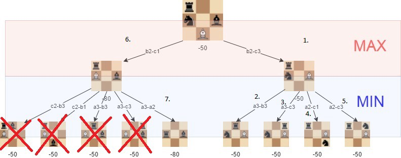

图2 alpha-beta 剪枝

如果使用 alpha-beta 剪枝并且按照描述的顺序访问树，可以避免搜索我们不需要探索的位置。使用 alpha-beta，我们可以显着提升 minimax 算法。

**Move Ordering**

只要Alpha-Beta搜索可以找到比其他着法好的着法，它就能对搜索树作出非常有效的裁减，这就意味着，关键在于首先搜索好的着法。当我们在搜索其他着法以前先搜索到最好的着法，那么最好的情况就发生了。然而最坏的情况，搜索着法的顺序是按评分递增的，即每次搜索到的着法都比曾经搜索的着法要好，那么这种情况下的Alpha-Beta搜索就无法作出任何裁减，这种搜索将退化为极其浪费的“最小-最大”搜索。

对搜索进行排序是相当重要的。让着法随便排列肯定不行，我们必须找到更聪明的办法。不幸的是，如果有简单的办法知道最好的着法，那还有搜索的必要吗？因此我们必须用“猜最好的着法”来对付。

有很多技术可以让着法的顺序排列成尽可能好的顺序：

1\. 用评估函数对着法打分，然后排序。直觉上这会起到作用，评估函数越好，这个方法就越有效。不幸的是在象棋中它一点也不起作用，因为下个月我们将了解到，很多局面是不能准确评估的。

2\. 找到在置换表（Transposition Table）中已经存在的局面，如果它的数值足够好，就会产生截断，这样就不必再进行其他搜索了。

3\. 尝试特定类型的着法。例如，后被吃掉肯定是最坏的想法，所以先检查吃子的着法是行之有效的。

4\. 把这个思路进行拓展，关注已经在同一层深度产生过截断的着法。“杀手启发”(Killer Heuristic)是建立在很多着法是次序无关的基础上的。如果你的后被攻击了，不管你把H2兵挺一格还是两格，对手都会吃掉你的后。因此，如果在搜索H2-H3着法时，“象吃掉后”的着法会产生截断，那么在搜索H2-H4着法时，“象吃掉后”很有可能也产生截断，当然应该首先考虑“象吃掉后”这一步。

5\. 再把杀手启发拓展到历史表上。如果在前面几回合的搜索中，发现G2-E4的着法很有效，那么很有可能现在仍然很有用(即便原来的格子是象而现在变成了后)，因为棋盘其他位置的情况不太可能有多少变化。

以上5种策略都应用在我的程序中。开始搜索前，先按如下顺序处理：搜索置换表-\>尝试杀手着法-\>空着裁剪-\>移动排序（借助历史表评估）。对于根节点，最有效的方法却稍稍有背于人的直觉，这个方法称为“迭代加深”(Iterative Deepening)。

**Iterative Deepening**

如果你正在搜索6层的局面，那么理想的着法顺序应该由同样层数搜索的结果来产生。既然这明显是不可能做到的，那么能否用稍浅的搜索(比如说5层)来代替呢？

这就是迭代加深方法背后的思想——一开始搜索2层，用这样种搜索产生的着法顺序来搜索3层，反复如此，直到到达规定的深度。

这个技术会受到一般人的质疑——大量的努力是重复的(8到10次乃至更多)，不是吗？

那么考虑一下搜索树的深度n和分枝因子b好了。搜索树在第1层的结点数为b，第2层是b2，第三层是b3，等等。如果b很大(记住中局时在35左右)，那么绝大多数工作量取决于最后一层。重复搜索(n - 1)的深度其实是小事一桩，即便迭代加深一点也不起作用，它也只会多花4%的时间(在通常的局面上)。

但是，它的优势是非常可观的——由浅一层搜索的结果排列得到的顺序，在层数加深时可以大幅度增加截断率。因此，迭代加深的Alpha-Beta搜索实际上找的结点数，会比直接的Alpha-Beta搜索的少很多。在使用置换表后，它的收效就更可观了——重复搜索浅的部分就几乎不需要时间了，因为这些结果在置换表里都有，没有必要重新计算了。

另外，迭代加深可以大幅度提高历史表的效率，在前一次N层的搜索中历史表已经有相当丰富的历史着法信息了，在做N + 1层搜索时，这些历史信息可以让着法有更好的顺序。

而且，采用迭代加深的策略能够很方便的实现搜索时间的控制，当我搜索完某一节点后，根据设定的最大时间可以选择继续搜索或是终止。当我将搜索深度设置为5层时，程序可能在2s时间就能够做出反应，而许多时候我们并不要求它很快做出回应，而是希望它选择一个更好的走法。这时它就可以继续搜索，直至时间用尽。

**Transposition Table**

国际象棋的搜索树可以用图来表示，而置换结点可以引向以前搜索过的子树上。置换表可以用来检测这种情况，从而避免重复劳动。如果“1. e4 d6 2. d4”以后的局面已经搜索过了，那就没有必要再搜索“1. d4 d6 2. e4”以后的局面了。这个原因可能鼓舞着早期的电脑国际象棋程序的设计师们，而现在事实上这还是置换表的次要用途。在某些局面，例如在没有通路兵的王兵残局中，检查到的置换的数量是惊人的，以至于搜索可以在短达时间内达到很深的深度。

省去重复的工作，这是置换表的一大特色，但是在一般的中局局面里，置换表的另一个作用更为重要。每个散列项里都有局面中最好的着法，而首先搜索好的着法可以大幅度提高搜索效率。因此如果你在散列项里找到最好的着法，那么你首先搜索这个着法，这样会改进你的着法顺序，减少分枝因子，从而在短的时间内搜索得更深。

至于置换表存储哪些数据、置换策略等较为复杂，此处不再赘述。

**Killer Heuristic**

一种动态的、依赖于路径的移动排序技术。它将导致兄弟节点中的beta-cutoff的移动视为杀手移动，并将它们排在列表的高位，这些着法通常来说大概率也能够产生beta截断。通常每层包含两个或三个移动。替换方案应该确保所有可用的插槽都包含不同的移动。

在移动排序中，杀手移动通常在散列移动和（好）捕获之后立即出现。这种启发式背后的逻辑如下。在许多情况下，只有一小部分动作会造成威胁或防御威胁，而那些无法做到这一点的动作可能会被对手的同一动作驳回（“杀死”）。

**Null-Move Heuristic**

有个加快象棋程序速度的有效方法，就是引入空着的概念。

简而言之，空着就是自己不走而让对手连走两次。大多数局面中，什么事都不做显然不是办法，你总是必须做点事情来改善局面。在搜索中让电脑走空着，可以提高速度和准确性。例如：

1\. 假设局面对你来说是压倒性优势，即便你什么都不走，对手也无法挽回。(用程序的术语来说，你不走棋也可以产生Beta截断。)假设这个局面本来准备搜索N层，而空着取代了整个搜索树(你的所有合理着法用空着取代了)，并且你的分枝因子是B，那么搜索空着就相当于只搜索了一个N-1层的分枝，而不是B个这样的分枝。在中局阶段通常B=35，所以空着搜索只消耗了完整搜索所需的3%的资源。如果空着搜索表明你已经强大到没有必要再走棋(即会产生截断)的地步，那么你少花了97%的力气。如果没有，你就必须检查合理的着法，这只是多花了3%的力气。平均来说，收益是巨大的。

2\. 假设在静态搜索中，你面对一个只有车吃兵一种吃子着法的局面，然而接下来对手就会走马吃车。你最好不去吃子而走其他不吃子的着法对吗？你可以在静态搜索中插入空着来模拟这种情况，如果在某个局面下空着比其他吃子着法有利，那么你继续吃子就是坏的选择。并且由于最佳着法是静态着法，所以这个局面就是评估函数可以作用的局面。

总的来说，空着启发会减少20%到75%的搜索时间。这当然值得，特别是当你把这个方法用在静态搜索算法上的时候，就像改变“走子的一方”这种代码一样简单，用不了十行就行了。

**PVS and Aspiration**

Principal Variation Search (PVS)，对Alpha-Beta的增强，基于对非PV 节点（通常将结点分为PV-node、beta-cutoff node以及all-node三种，详情可见chessprogramming.org）的零窗口或零窗口搜索，以证明移动是否比来自主要变化（Principal Variation）的已经安全的分数更差。

在大多数节点中，我们只需要一个bound，证明一个动作对我们或对手来说是不可接受的，而不是确切的得分。这仅在所谓的主要变化中需要- 两个玩家都可以接受的一系列移动（即不会在路径中的任何地方造成beta-cutoff），预计会向下传播到根。如果较低深度的搜索已经建立了这样的序列，在整个分支中找到一系列值大于alpha但低于beta的移动，那么偏离它可能对我们没有好处。所以在一个PV 节点仅在整个窗口中搜索第一步（迭代深化框架的前一次迭代认为最好的一步）以建立预期的节点值。

当我们已经有了PV 移动（定义为在 PV 节点中提高 alpha 的移动）时，我们假设我们会坚持下去。为了证实我们的信念，以 alpha 为中心的零窗口或零窗口搜索被用来测试新动作是否会更好。如果是这样，对于空窗口而不是完整窗口，我们必须用完整的正常窗口重新搜索。由于空窗口搜索花费更小，通过良好的移动排序，我们预计可以节省大约 10% 的搜索工作量。

**2.4 评估**

首先考虑的是不同棋子的价值，做出如下设定：

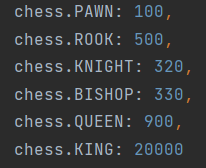

评估，一种启发式函数，用于确定位置的相对值，即获胜的机会。如果我们能在每一行中看到对局的结束，评估将只有 -1（输）、0（平局）和 1（赢）的值，并且国际象棋引擎应该只搜索深度 1 以获得最好的举动。然而在实践中，我们不知道一个位置的确切值，所以我们必须做一个近似，主要目的是比较位置，而国际象棋引擎现在必须深入搜索并找到给定时间段内得分最高的位置。

最近，有两种主要的评估方法：传统的手工评估（HCE）和多层神经网络。本页重点介绍考虑国际象棋位置的显式特征的传统方式。

国际象棋初学者从棋子本身的价值开始学习这样做。计算机评估功能也将物料平衡的价值作为最重要的方面，然后添加其他考虑因素。

编写评估函数时首先要考虑的是如何在Minimax或更常见的NegaMax框架中对移动进行评分。Minimax 通常将白方与最大玩家关联，将黑方与最小玩家关联，并且始终从白方的角度进行评估，而 NegaMax 需要相对于要移动的一侧进行对称评估。我们可以看到，一个棋子本身不能得分——而是棋子的结果（即棋盘的位置评估是棋子的结果）。Claude Shannon在 1949 年[2]首次提出了这样的对称评估函数 ：

f(p) = 200(K-K')

\+ 9(Q-Q')

\+ 5(R-R')

\+ 3(B-B' + N-N')

\+ 1(P-P')

\- 0.5(D-D' + S-S' + I-I')

\+ 0.1(M-M') + ...

KQRBNP = number of kings, queens, rooks, bishops, knights and pawns

D,S,I = doubled, blocked and isolated pawns

M = Mobility (the number of legal moves)

在这里，我们可以看到分数是从对手的棋盘分数的等效评估中减去当前方分数的结果（由素数字母 K' Q' 和 R'.. 表示）。

相对移动侧

为了让NegaMax工作，返回相对于被评估边的分数很重要。例如，考虑一个简单的评估，它只考虑材料和移动性：

materialScore = kingWt \* (wK-bK)

\+ queenWt \* (wQ-bQ)

\+ rookWt \* (wR-bR)

\+ knightWt\* (wN-bN)

\+ bishopWt\* (wB-bB)

\+ pawnWt \* (wP-bP)

mobilityScore = mobilityWt \* (wMobility-bMobility)

返回相对于要移动的一侧的分数（who2Move = +1 表示白色，-1 表示黑色）：

Eval = (materialScore + mobilityScore) \* who2Move

线性与非线性

大多数评估项是独立特征和相关权重的线性组合，形式为

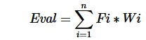

如果函数是可加的，则函数f是线性的：

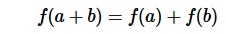

其次，如果函数是1次齐次的：

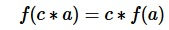

它取决于特征的定义和独立性以及选择公理的接受度( Ernst Zermelo 1904)，加法实数函数是否是线性的。特征要么与单个棋子（材料）、它们的位置（棋子表）相关，要么更复杂，考虑到多个棋子和棋子的交互，基于某些模式或块。通常需要几个阶段来首先处理简单的特征，然后在构建适当的数据结构之后，在连续的阶段中使用基于模式和块的更复杂的特征。

基于此，区分一阶、二阶等项，比使用任意项线性与非线性评估[4]更有意义。关于调优，必须注意特性是独立的，这并不总是那么简单。否则，隐藏的依赖关系可能会使评估函数难以维护，并产生不希望的非线性效应。

**三、 程序运行结果展示**

**1.通过控制台**

1.  初始页面，选择黑棋或者白棋

**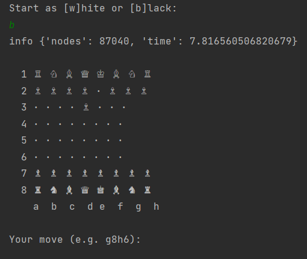**

1.  输入操作进行棋子的移动

    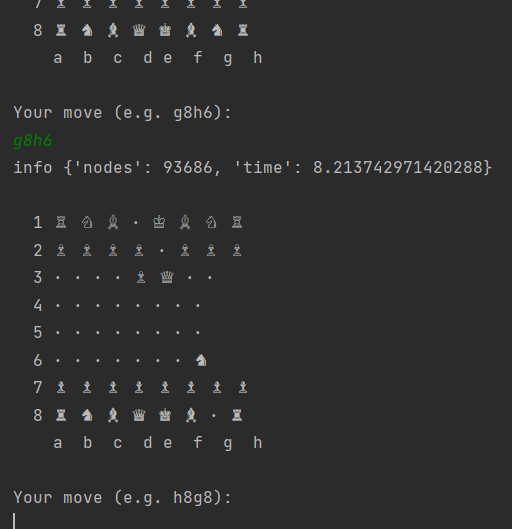

2.  中间步骤

    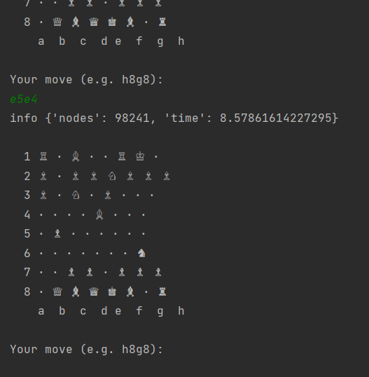

3.  结束

    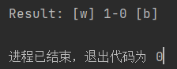

**2.连接lichess**

Cmd输入如下命令以激活lichess。

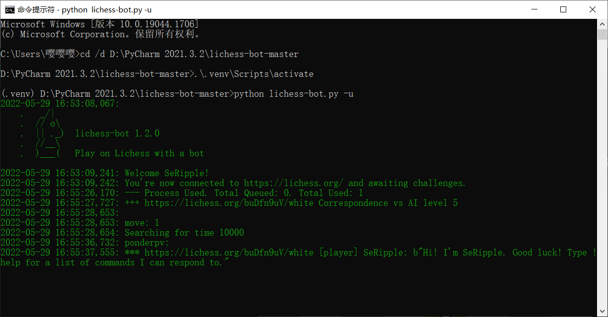

激活lichess

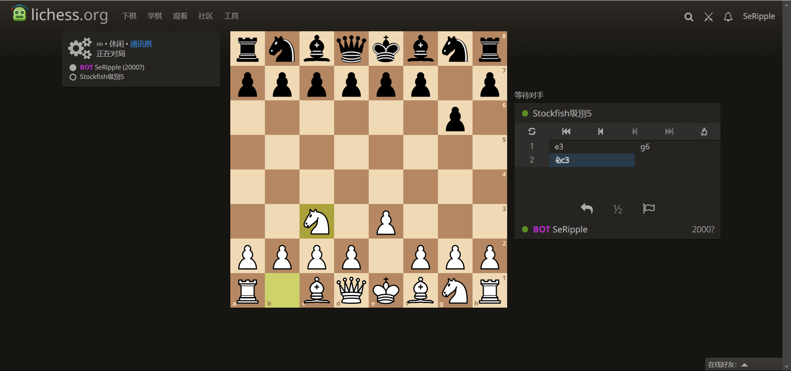

lichessUI界面
